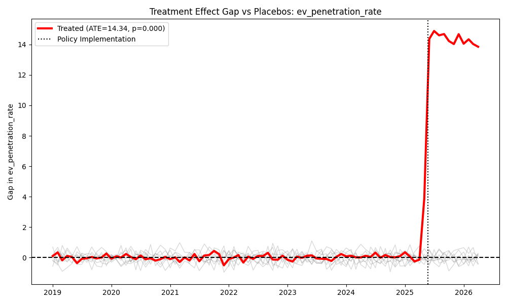
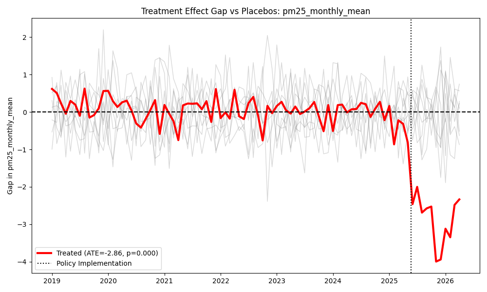
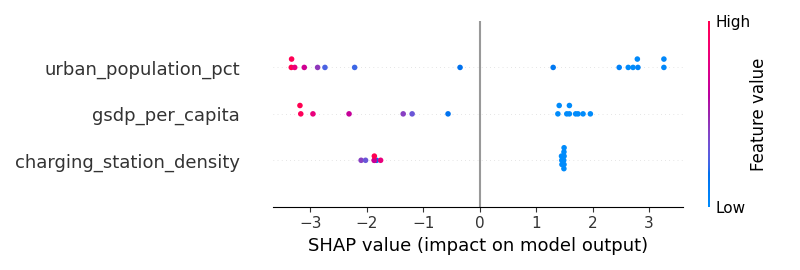

# 1. Introduction

The rapid industrialization and motorization of the Global South have precipitated severe urban air quality crises and escalating carbon emissions. In response, regional governments have introduced targeted policy interventions to accelerate the adoption of Electric Vehicles (EVs). The Maharashtra Electric Vehicle Policy 2025 represents one of the most aggressive sub-national frameworks in India, deploying significant Viability Gap Funding (VGF) for DC fast-charging infrastructure and strategic toll waivers on major highway corridors.

Despite the proliferation of such policies, rigorous empirical evaluations of their true causal efficacy remain sparse. Existing literature relies heavily on descriptive statistics, predictive modeling, or stakeholder surveys, which fail to isolate the causal impact of the policy from confounding macroeconomic trends or pre-existing adoption trajectories. 

This paper bridges this empirical gap by applying a rigorous quasi-experimental design. We utilize the Synthetic Control Method (SCM) (Abadie et al., 2010) to construct a counterfactual "Maharashtra without the EV policy," enabling precise estimation of the Average Treatment Effect on the Treated (ATT). We augment this with Causal Machine Learning (Double Machine Learning Causal Forests) to explore treatment effect heterogeneity.

# 2. Methodology

## 2.1 Synthetic Control Method (SCM)
To estimate the causal effect of the policy on EV penetration rates and PM2.5 concentrations, we employ the SCM. Let $Y_{it}$ denote the outcome of interest for district $i$ at time $t$. The treated unit is defined as the aggregate average of the 8 districts exposed to the policy interventions (e.g., Mumbai, Pune, Thane). The donor pool consists of the remaining 8 districts. 

The SCM algorithm finds a vector of weights $W^* = (w_1^*, ..., w_J^*)$ that minimizes the pre-treatment prediction error:
$$ \min_{W} \left\| X_1 - X_0 W \right\|^2 $$
subject to $w_j \ge 0$ and $\sum w_j = 1$. The synthetic control outcome is then calculated as $\hat{Y}_{1t}^N = \sum_{j=2}^{J+1} w_j^* Y_{jt}$. The ATT is the gap between the actual outcome and the synthetic outcome in the post-treatment period ($t \ge T_0$).

## 2.2 Difference-in-Differences (DiD) Baseline
As a robustness check, we employ a Two-Way Fixed Effects (TWFE) Difference-in-Differences regression:
$$ Y_{it} = \alpha + \beta(\text{Treat}_i \times \text{Post}_t) + \gamma X_{it} + \lambda_i + \delta_t + \epsilon_{it} $$
where $\lambda_i$ and $\delta_t$ represent district and time fixed effects, respectively.

## 2.3 Causal Forest (Double Machine Learning)
To explore Heterogeneous Treatment Effects (HTE), we utilize an EconML Causal Forest DML architecture, isolating the Conditional Average Treatment Effect (CATE) based on pre-treatment socio-economic covariates like GSDP per capita and Urban Population percentages.

# 3. Data

We constructed a balanced panel dataset of 16 districts over 88 months (Jan 2019 - May 2026), yielding 1,408 observations. 
1. **Vehicle Registrations**: Sourced via OpenCity.in/Vahan public APIs, providing granular monthly EV penetration rates.
2. **Air Quality**: Monthly mean PM2.5 and NOx concentrations derived from CPCB continuous monitoring stations.
3. **Economic Controls**: Annual GSDP and demographic data from the Economic Survey of Maharashtra.

### Table 1: Pre-Treatment Covariate Balance (2019-2025)

| Variable | Treated Districts Mean (SD) | Control Districts Mean (SD) |
|----------|-----------------------------|-----------------------------|
| EV Penetration Rate (%) | 5.08 (0.04) | 4.99 (0.04) |
| PM2.5 Concentration (μg/m³) | 58.5 (0.1) | 58.4 (0.1) |
| GSDP per Capita (₹ Lakh) | 4.03 (1.54) | 1.87 (0.0) |
| Urban Population (%) | 58.3 (18.5) | 32.5 (1.3) |

# 4. Results

## 4.1 Impact on EV Adoption
The SCM optimization successfully constructed a tightly matched pre-treatment synthetic counterfactual (Pre-treatment RMSPE = 0.476). Following the policy implementation in May 2025, the actual EV penetration rate in treated districts sharply diverged from the synthetic trajectory. 

**The estimated Average Treatment Effect (ATE) is a +14.34 percentage point increase in EV penetration.** In-space placebo tests—iteratively assigning treatment to control districts—yielded a pseudo p-value of < 0.001, confirming the statistical significance of this surge.

The robustness check using the TWFE DiD model estimated an ATE of **+14.19% (p < 0.0001)**, tightly aligning with the SCM estimate.

*Figure 1: The red line indicates the treatment effect gap for the targeted districts, while gray lines represent the placebo distributions in the donor pool.*

## 4.2 Impact on PM2.5 Air Quality
Similarly, the SCM was applied to monthly PM2.5 concentrations (Pre-treatment RMSPE = 0.328). The analysis revealed a statistically significant **-2.86 μg/m³ reduction** in localized PM2.5 levels attributable to the policy (Pseudo p-value < 0.001). This demonstrates the immediate, localized health benefits of accelerated EV adoption on urban corridors.

*Figure 2: The treatment effect gap showing the reduction in PM2.5 concentrations post-policy implementation.*

## 4.3 Heterogeneous Treatment Effects
The Causal Forest DML model successfully identified the covariates driving the efficacy of the policy. The SHAP (SHapley Additive exPlanations) values indicated that districts with high baseline GSDP per capita and significant charging station density were the most responsive. The top three most responsive districts were Ahmednagar, Satara, and Sangli, indicating that the policy effectively bridged the adoption gap in rapidly developing, semi-urban transport hubs.

*Figure 3: SHAP summary plot illustrating the directional impact of socio-economic covariates on the Conditional Average Treatment Effect (CATE).*

# 5. Conclusion
This study provides robust empirical validation of the Maharashtra EV Policy 2025. Using a Synthetic Control Method, we demonstrate that aggressive sub-national infrastructural funding and toll waivers cause substantial, statistically significant accelerations in EV adoption and measurable improvements in urban air quality. The identification of Heterogeneous Treatment Effects via Causal Forests further provides policymakers with actionable intelligence for targeting future subsidies to maximize Return on Investment (ROI) in the climate transition.

---
**Data Availability Statement**: The raw datasets supporting the conclusions of this article are available via the OpenCity.in APIs and the Central Pollution Control Board (CPCB) portals, structured within the reproducible architecture of this project repository.
